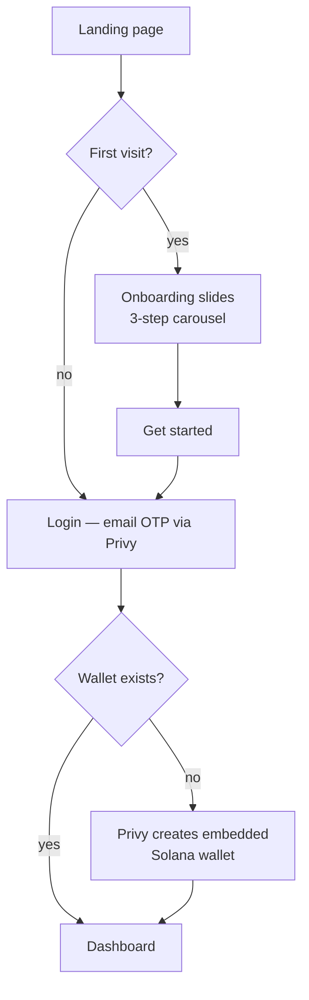
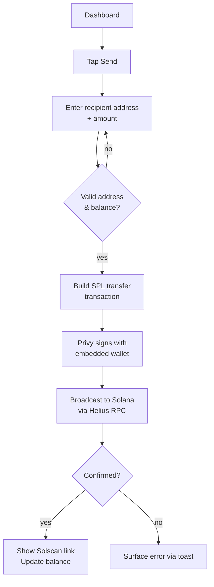
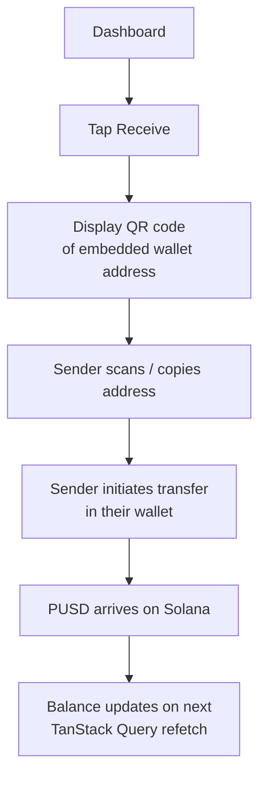
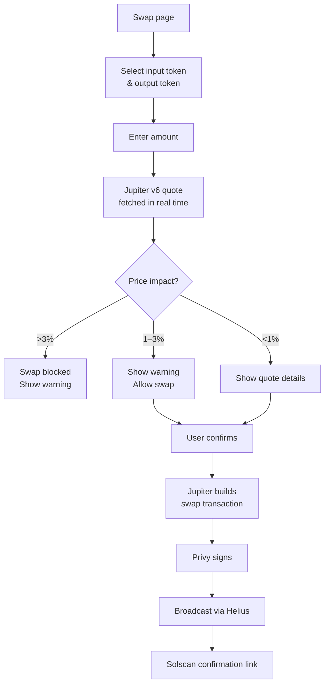
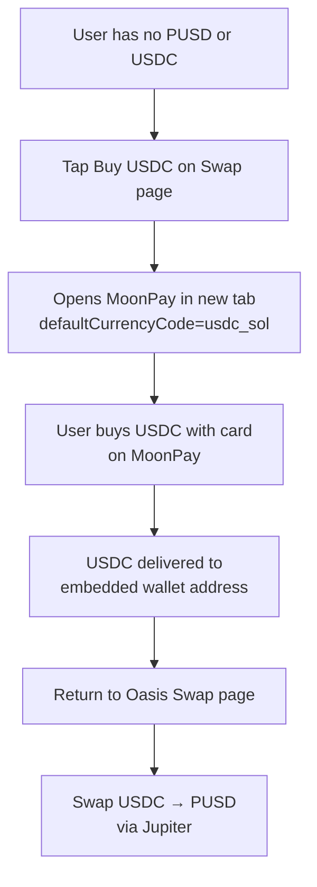
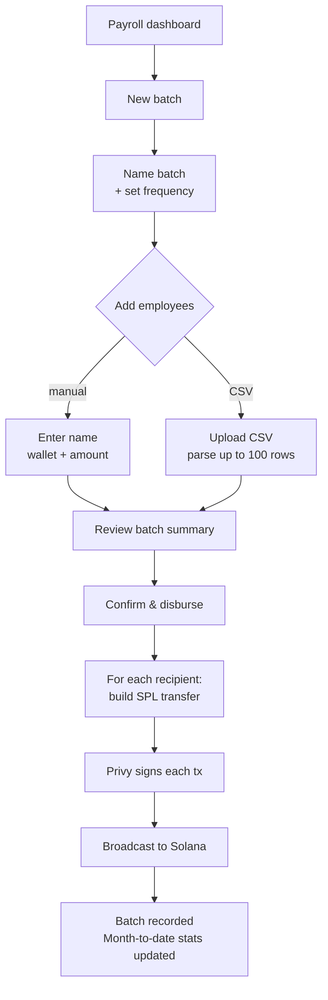
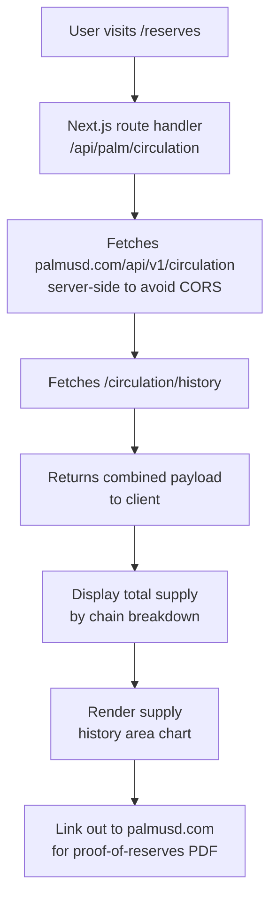

# Oasis

A non-custodial web wallet and finance platform built on **Palm USD (PUSD)** — a 6-decimal, non-freezable stablecoin native to Solana, Ethereum, BNB, TRON, and ADI. v1 ships Solana-only.

> Self-custody. No volatility. Every transaction is final.

---

## What it is

Oasis lets individuals and businesses hold, send, swap, earn, and spend PUSD from a single web app. There is no centralized custody, no admin freeze key, and no blacklist — users own their keys via Privy's embedded wallet.

The primary B2B differentiator is the **Payroll** module: bulk PUSD disbursements to up to 100 employees, CSV-importable, with recurring schedule support. Everything else (wallet, swaps, analytics, transparency) supports the individual use case.

---

## Tech stack

| Layer | Choice |
|---|---|
| Frontend | Next.js 15 (App Router) + Tailwind v3 + shadcn/ui |
| Auth | Privy web SDK — email OTP + embedded Solana wallet |
| Chain | Solana via @solana/web3.js + @solana/spl-token |
| Swaps | Jupiter v6 API |
| State | TanStack Query (chain reads) + Zustand (UI state) |
| Backend | Hono on Bun + Postgres (Neon) + Drizzle ORM on Railway |
| Hosting | Vercel (web) + Railway (API) |

---

## Features

### Wallet
The home screen. Shows live PUSD balance, quick-action Send/Receive buttons, and the last 5 transactions. Full transaction history is linked to Statistics.

### Send
Modal-driven send flow. Accepts a Solana wallet address and PUSD amount. Builds and signs an SPL token transfer via the embedded Privy wallet. All amounts are represented as `bigint` (6 decimals) internally and formatted only at render.

### Receive
Generates a QR code of the user's embedded wallet address for peer-to-peer PUSD receipt.

### Statistics
Earning and spending analytics with period filters: Today, Weekly, Monthly, Yearly. Rendered as a dual-bar Recharts chart (lime = earned, dark = spent). Reads from on-chain transaction history.

### Swaps
PUSD ↔ USDC swaps via Jupiter v6. Features:
- Configurable slippage (0.1% / 0.5% / 1%)
- Real-time price impact with blocking at >3%
- Best-route display
- Solscan transaction link after confirmation
- MoonPay CTA for users who need to buy USDC with a card first

### Payroll
Bulk PUSD payouts for businesses. Features:
- Named batches with up to 100 employee recipients
- CSV import for recipient lists
- Recurring frequency support (weekly, biweekly, monthly)
- Month-to-date spend summary dashboard
- One wallet signature per recipient disbursement

### Transparency
Live PUSD circulating supply pulled from Palm's public API (`palmusd.com/api/v1/circulation` + `/circulation/history`). Displays:
- Total circulating supply by chain (Ethereum, Solana, BSC, ADI)
- Historical supply area chart
- Link out to palmusd.com for proof-of-reserves attestations

### Commerce (stub)
Bitrefill product catalog — browse gift cards, mobile refills, eSIMs, and bill payments. Bitrefill does not accept PUSD; the page surfaces a swap-to-USDC banner. No in-app checkout — clicks open bitrefill.com.

### Shopping / Gift Cards
v1 shells, deferred to v2.

---

## Flow diagrams

### Auth & onboarding



### Send PUSD



### Receive PUSD



### Swap PUSD ↔ USDC



### Fiat onramp (MoonPay path)



### Payroll batch



### Transparency / Reserves



---

## PUSD token addresses

| Chain | Address |
|---|---|
| Ethereum | `0xfaf0cee6b20e2aaa4b80748a6af4cd89609a3d78` |
| Solana | see `lib/tokens/pusd.ts` |
| BNB / TRON / ADI | see `lib/tokens/pusd.ts` |

Decimals: **6** on all chains.

PUSD has no admin key, no freeze function, and no blacklist. All transfers are final once confirmed.

---

## Project structure

```
oasis/
  app/
    (auth)/         login, onboarding
    (app)/          dashboard, stats, swap, payroll, commerce, profile
    reserves/       transparency screen
    api/            server route handlers (palm proxy, payroll, etc.)
  components/
    ui/             shadcn primitives
    wallet/         BalanceCard, QuickActions, SendDialog, ReceiveDialog, TxRow
    nav/            Sidebar, TopBar
  hooks/            TanStack Query hooks (chain reads only)
  lib/
    solana/         jupiter.ts, transfer.ts
    tokens/         pusd.ts (addresses + formatPusd)
  stores/           Zustand slices (UI/draft state only)
  theme/            design tokens
oasis-backend/      Hono + Bun API service (separate Railway deploy)
```

---

## Running locally

```bash
cd oasis
cp .env.example .env.local   # fill in Privy app ID, Helius RPC, Bitrefill key
npm install
npm run dev                   # http://localhost:3000
```

Backend:
```bash
cd oasis-backend
bun install
bun dev                       # http://localhost:3001
```
