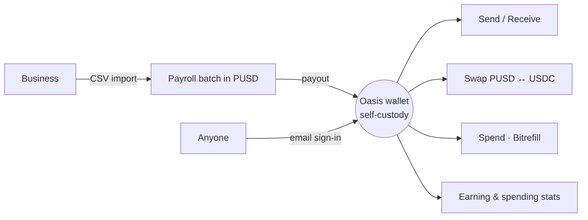

# Oasis

> Stablecoin banking for people. Payroll for businesses. Built on Palm USD.

**Live app → [oasis-pusd.vercel.app](https://oasis-pusd.vercel.app)**

**Oasis is a non-custodial wallet and finance app built on Palm USD (PUSD) — a dollar-pegged stablecoin on Solana.** Hold, send, swap, earn, and spend dollars without the volatility, without a custodian, without a seed phrase. You sign in with email; an embedded Solana wallet is created that only you control. Transfers settle in under a second for a fraction of a cent, and they're final the moment they confirm.

---

## The problem

Stablecoins settled more value last year than Visa — yet almost none of it reached **payroll**, the highest-trust, highest-frequency money movement in any business. International contractor payroll still takes three to five days, leaks 3–7% to fees and FX spread, and the person waiting has no idea when it lands.

The reason isn't the rails — it's that no product makes the *full loop* usable: a company funds a wallet, runs a batch, and the employee actually **receives and spends** it. Oasis is that loop.

---

## How it works

Sell payroll to the employer — and every employee becomes a user of the wallet, swaps, stats, and spending around it. That's the flywheel.

---

## What's inside

| Module | What it does |
|---|---|
| **Wallet** | Live PUSD balance, one-tap send and receive, transaction history. Email sign-in, embedded self-custody wallet, sub-second settlement. |
| **Payroll** | The B2B wedge. Create a batch, import up to 100 people from CSV, set a recurring cadence, pay the whole team in PUSD — instant, near-free, transparent. |
| **Swaps** | PUSD &harr; USDC routed through Jupiter for best execution, with price-impact protection. A MoonPay path lets anyone buy in with a card. |
| **Statistics** | Earning and spending bucketed by day, week, month, year — the income dashboard a bank app gives you and most wallets don't. |
| **Commerce** | A built-in Bitrefill catalog: gift cards, mobile top-ups, eSIMs, bill pay across 200+ countries. The dollars you earn don't have to leave the ecosystem to be useful. |
| **Transparency** | Live PUSD circulating supply by chain, pulled from Palm's public API. Verify the float yourself. |

---

## Why PUSD

Palm USD is a 6-decimal dollar stablecoin with **no admin key, no blacklist, no pause function**. Every transfer is final the moment it confirms — there's nothing to freeze and no one to ask. If your code works with USDC, it works with PUSD; there's no SDK to integrate.

---

## Design

Lime-green, cream, near-black — a fintech aesthetic that deliberately doesn't look like crypto. The product a normal person and a payroll manager both feel comfortable opening.

---

## Status

**v1 is Solana-only and web-first.** Live today: Wallet, Payroll, Swaps, Statistics, Commerce, Transparency. Gift Cards and Shopping are stubs on the roadmap. PUSD is native on five chains; multi-chain support is post-v1.

---

## Links

- Live app — [oasis-pusd.vercel.app](https://oasis-pusd.vercel.app)
- Palm USD — [palmusd.com](https://www.palmusd.com)
- Circulation API — `https://www.palmusd.com/api/v1/circulation`
